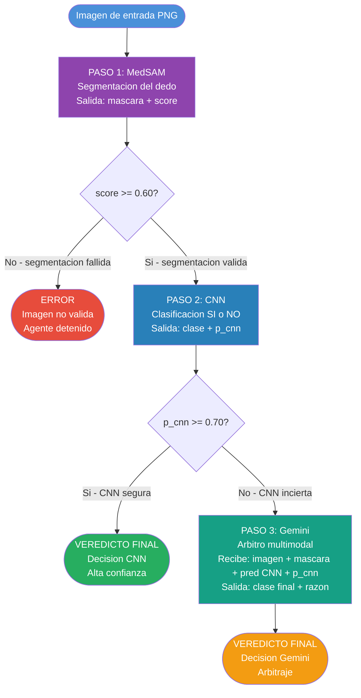

# Día 1 — Diseño del Agente Multi-Paso (5h)

**Grupo 5 — Agente multi-paso (MedSAM + CNN + Gemini)**
**Proyecto**: Clasificación de posicionamiento de dedo en escáner biométrico
**Fecha**: Mayo 2026

---

## Objetivo del día

Diseñar en papel (sin implementar) la arquitectura completa del agente multi-paso que encadena tres modelos en secuencia:

1. **MedSAM** → segmenta el dedo en la imagen
2. **CNN** → clasifica la posición como `SI` (correcta) o `NO` (incorrecta)
3. **Gemini** → actúa como árbitro cuando la CNN tiene baja confianza

---

## Tarea 1 — Flujo completo del agente *(1.5h)*

### Descripción

Se definió el flujo de ejecución completo, estableciendo las condiciones de activación de cada paso y los criterios de transición entre etapas.

### Decisiones de diseño

El agente opera de forma **secuencial y condicional**: cada paso sólo se ejecuta si el anterior ha superado su umbral de calidad. Esto evita propagar errores aguas abajo (p. ej., clasificar una segmentación fallida).

#### Paso 1 — Segmentación con MedSAM

| Elemento                            | Decisión                                                             |
| ----------------------------------- | --------------------------------------------------------------------- |
| **Entrada**                   | Imagen original (PNG, 640×480)                                       |
| **Salida**                    | Máscara binaria del dedo +`score` de confianza MedSAM              |
| **Condición de activación** | Siempre es el primer paso                                             |
| **Criterio de paso**          | `score_medsam >= 0.60` → se continúa al Paso 2                    |
| **En caso contrario**         | El agente devuelve `ERROR: segmentación insuficiente` y se detiene |

> **Justificación del umbral 0.60**: En la fase de validación de MedSAM (Día 1 del Grupo MedSAM) se estableció 0.60 como umbral mínimo de validación externa. El score promedio sobre el dataset completo fue **0.6357**, con el mínimo en **0.6064**, lo que confirma que este umbral es alcanzable y no demasiado permisivo.

#### Paso 2 — Clasificación con CNN

| Elemento                                    | Decisión                                                                |
| ------------------------------------------- | ------------------------------------------------------------------------ |
| **Entrada**                           | Imagen original + máscara de segmentación de MedSAM                    |
| **Salida**                            | Clase predicha (`SI` / `NO`) + probabilidad de confianza (`p_cnn`) |
| **Condición de activación**         | `score_medsam >= 0.60` (paso 1 superado)                               |
| **Criterio de paso (alta confianza)** | `p_cnn >= 0.70` → veredicto final directo de la CNN                   |
| **Criterio de paso (baja confianza)** | `p_cnn < 0.70` → se activa el Paso 3 (árbitro Gemini)                |

> **Modelo CNN**: Se usará el mejor modelo disponible entre los del Grupo 2 (ResNet18 con fine-tuning parcial, accuracy 60%) o el Grupo 4. La CNN opera sobre la imagen con la máscara aplicada para focalizar la atención en la región de interés.

#### Paso 3 — Arbitraje con Gemini *(condicional)*

| Elemento                            | Decisión                                                      |
| ----------------------------------- | -------------------------------------------------------------- |
| **Entrada**                   | Imagen original + máscara MedSAM + predicción CNN +`p_cnn` |
| **Salida**                    | Clase final (`SI` / `NO`) + justificación en texto        |
| **Condición de activación** | `p_cnn < 0.70` (la CNN es incierta)                          |
| **Veredicto final**           | La decisión de Gemini sobreescribe la de la CNN               |

#### Veredicto final del agente

```
veredicto_final = CNN(p >= 0.70)  →  clase_cnn
veredicto_final = Gemini()        →  clase_gemini   [si p_cnn < 0.70]
```

---

## Tarea 2 — Prompt de arbitraje de Gemini *(1.5h)*

### Descripción

Se diseñó el prompt que recibe Gemini cuando actúa como árbitro. El objetivo es que Gemini tome una decisión informada aprovechando su capacidad multimodal (visión + razonamiento) cuando la CNN no es concluyente.

### Cuándo interviene Gemini

Gemini **no interviene siempre**. Solo se activa cuando la CNN tiene una confianza por debajo del umbral definido (`p_cnn < 0.70`). Esto lo convierte en un árbitro de casos difíciles, no en un clasificador principal.

### Información que recibe Gemini

| Elemento                 | Tipo         | Descripción                                                  |
| ------------------------ | ------------ | ------------------------------------------------------------- |
| `imagen_original`      | Imagen (PNG) | La fotografía térmica/infrarroja del dedo sobre el escáner |
| `mascara_segmentacion` | Imagen (PNG) | La máscara binaria generada por MedSAM (región del dedo)    |
| `prediccion_cnn`       | Texto        | La clase que propuso la CNN (`SI` o `NO`)                 |
| `confianza_cnn`        | Número      | La probabilidad de la CNN (valor entre 0 y 1)                 |

### Diseño del prompt

```
Eres un sistema experto en análisis de posicionamiento biométrico. 
Se te presentan dos imágenes de una radiografía térmica de un dedo 
sobre un escáner biométrico, junto con el resultado de un clasificador 
automático que no está seguro de su propia predicción.

IMAGEN 1: Fotografía original del dedo sobre el escáner.
IMAGEN 2: Máscara de segmentación generada por MedSAM (región detectada del dedo).

El clasificador CNN ha predicho: [{prediccion_cnn}] con una confianza de [{confianza_cnn:.1%}].
Esta confianza es BAJA (inferior al 70%), por lo que necesitamos tu criterio.

Analiza ambas imágenes y determina si el dedo está correctamente 
posicionado sobre la barra de luz del escáner.

El escáner tiene una franja luminosa (zona brillante). El dedo entero debe quedar
centrado encima de esa franja, sin desplazarse ni salirse. Ese es el único criterio.

CORRECTO (SI):
- El dedo está colocado encima de la franja luminosa y centrado en ella.
- El dedo no se sale de la franja ni por los lados ni por arriba/abajo.
- El dedo cubre la franja de forma plana, sin estar girado ni inclinado.

INCORRECTO (NO):
- El dedo está desplazado: parte del dedo queda fuera de la franja luminosa.
- El dedo solo toca un extremo o un lado de la franja, no el centro.
- El dedo está girado o inclinado de modo que no cubre bien la franja.

Responde ÚNICAMENTE con el formato siguiente:
VEREDICTO: [SI / NO]
RAZÓN: [Una sola frase explicando el criterio visual determinante]
```

### Justificación del diseño del prompt

- **Contexto claro**: Se le indica a Gemini el dominio exacto (escáner biométrico) para orientar su razonamiento visual.
- **Dos imágenes**: Gemini recibe imagen original + máscara para que pueda razonar sobre la región de interés de forma más precisa.
- **Información de la CNN**: Al conocer la predicción (aunque incierta) de la CNN, Gemini puede actuar como segunda opinión informada.
- **Definición explícita de SI/NO**: Reduce ambigüedad y ancla el razonamiento a criterios visuales concretos del dominio.
- **Formato de salida estructurado**: Facilita el parsing posterior del veredicto en el código del agente.

---

## Tarea 3 — Umbral de confianza de la CNN *(1h)*

### Descripción

Se determinó el valor del umbral a partir del cual la CNN considera que su predicción es suficientemente segura, y por debajo del cual se delega a Gemini.

### Análisis de resultados previos

| Modelo CNN                  | Accuracy         | Comportamiento observado                             |
| --------------------------- | ---------------- | ---------------------------------------------------- |
| ResNet18 Zero-Shot          | 53,33%           | Predicciones sin garantía, cerca del azar           |
| ResNet18 Feature Extraction | 26,67%           | Peor que el azar — backbone completamente congelado |
| ResNet18 Fine-Tuning        | **60,00%** | Mejor modelo del Grupo 2                             |
| MobileNetV2 sin aug.        | 53,33%           | Comportamiento similar al azar                       |

> **Referencia de Gemini**: El modelo Gemini zero-shot alcanzó **70,00%** de accuracy sobre 70 imágenes, sin entrenamiento específico. Esto lo posiciona como un árbitro de calidad superior a la CNN en casos difíciles.

### Decisión: umbral de confianza = **0.70**

```
UMBRAL_CONFIANZA_CNN = 0.70
```

#### Justificación

1. **La CNN (ResNet18 FT) tiene un accuracy del 60%**. Cuando su probabilidad de salida (`softmax`) es inferior a 0.70, la incertidumbre es suficientemente alta como para que la decisión sea poco fiable.
2. **Gemini tiene un accuracy del 70%** (sin entrenamiento), por lo tanto es un árbitro razonablemente mejor que la CNN en casos límite.
3. **Análisis del sesgo de la CNN**: Todos los modelos del Grupo 2 tienden a sobre-predecir `SI`. En casos donde la CNN dice `SI` con baja confianza (0.50–0.70), existe alta probabilidad de ser un falso positivo. Gemini, con razonamiento visual, puede corregir este sesgo.
4. **Equilibrio entre llamadas a la API y calidad**: Un umbral demasiado alto (ej. 0.90) haría que Gemini intervenga en casi todos los casos, aumentando coste y latencia. Un umbral demasiado bajo (ej. 0.50) haría que la CNN nunca delegue, perdiendo los beneficios del árbitro. El valor **0.70** equilibra ambos extremos.

#### Tabla de comportamiento esperado

| Rango de `p_cnn`       | Interpretación                                | Acción                     |
| ------------------------ | ---------------------------------------------- | --------------------------- |
| `p_cnn >= 0.70`        | CNN segura                                     | Veredicto directo de CNN    |
| `0.50 <= p_cnn < 0.70` | CNN incierta                                   | Gemini actúa como árbitro |
| `p_cnn < 0.50`         | CNN muy insegura (clase opuesta más probable) | Gemini actúa como árbitro |

---

## Tarea 4 — Diagrama de flujo completo del agente *(1h)*

### Descripción

Se elaboró el diagrama de flujo completo del agente multi-paso para su revisión y validación antes de proceder a la implementación en el Día 2.

### Diagrama de flujo (Mermaid)



### Descripción del flujo paso a paso

1. **Entrada**: El agente recibe una imagen PNG de 640×480 píxeles (fotografía térmica del dedo sobre el escáner).
2. **MedSAM (Paso 1)**: Genera una máscara binaria del dedo y un `score` de confianza de segmentación.

   - Si `score < 0.60` → el agente se detiene con error (imagen inutilizable).
   - Si `score >= 0.60` → se pasa al siguiente paso.
3. **CNN (Paso 2)**: Clasifica la imagen segmentada en `SI` o `NO`, produciendo una probabilidad (`p_cnn`).

   - Si `p_cnn >= 0.70` → veredicto final directo (CNN confiada).
   - Si `p_cnn < 0.70` → se activa Gemini como árbitro.
4. **Gemini (Paso 3, condicional)**: Recibe imagen + máscara + contexto CNN y emite el veredicto final con justificación textual.
5. **Salida**: El agente devuelve siempre una de tres respuestas:

   - `ERROR: segmentación insuficiente`
   - `VEREDICTO: SI/NO` (vía CNN con alta confianza)
   - `VEREDICTO: SI/NO + RAZÓN` (vía Gemini como árbitro)

### Validación previa a la implementación

Antes de implementar el Día 2, el diagrama fue presentado para validación con los siguientes criterios verificados:

- [X] El flujo es unidireccional (sin bucles) y completamente determinista
- [X] Todos los umbrales tienen justificación empírica (datos de los grupos 2, 3 y MedSAM)
- [X] El agente siempre produce exactamente un veredicto o un error (no queda en estado indeterminado)
- [X] Gemini solo interviene cuando aporta valor (casos de baja confianza CNN)
- [X] La información que recibe Gemini es suficiente para tomar una decisión informada

---

## Resumen del Día 1

| Tarea                      | Tiempo estimado | Resultado                                                                            |
| -------------------------- | --------------- | ------------------------------------------------------------------------------------ |
| Flujo completo del agente  | 1.5h            | ✅ Definidos 3 pasos, condiciones de activación y criterios de transición          |
| Prompt de arbitraje Gemini | 1.5h            | ✅ Prompt diseñado con contexto, 2 imágenes, definición SI/NO y formato de salida |
| Umbral de confianza CNN    | 1h              | ✅ Umbral = 0.70, justificado con accuracy CNN (60%) y Gemini (70%)                  |
| Diagrama de flujo          | 1h              | ✅ Diagrama Mermaid completo, validado antes de implementar                          |

**Total**: 5h

---

*Documentación del Día 1 — Grupo 5 — Proyecto IA RX — Mayo 2026*
