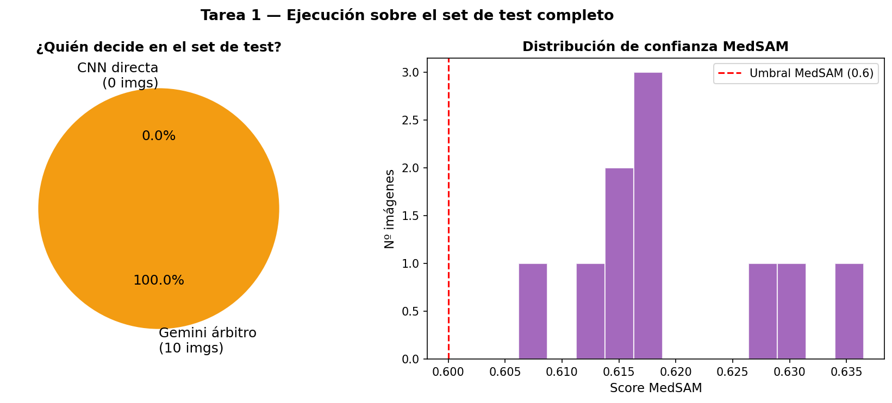
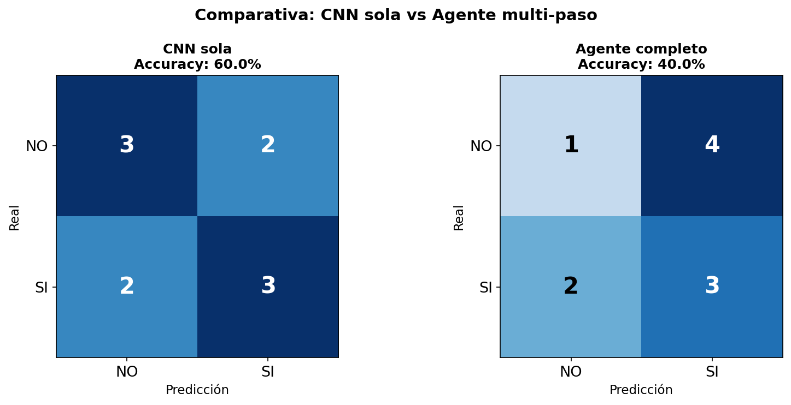
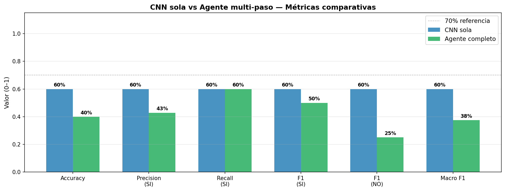
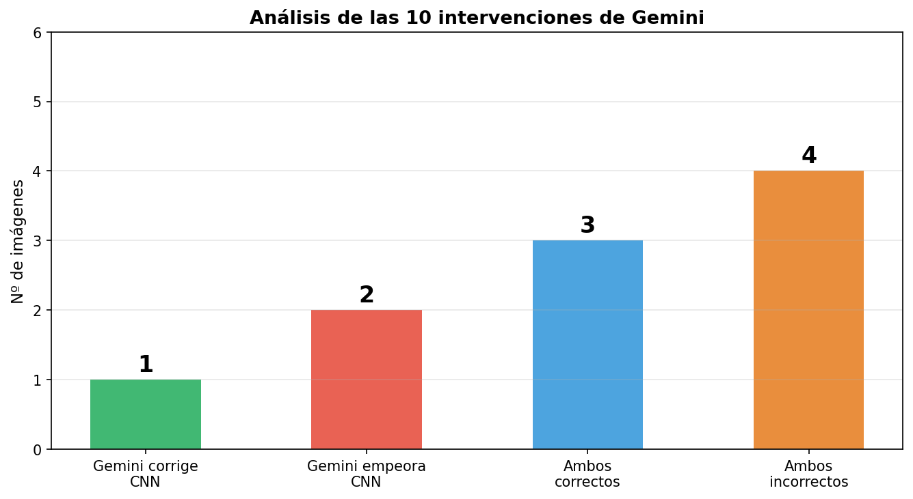
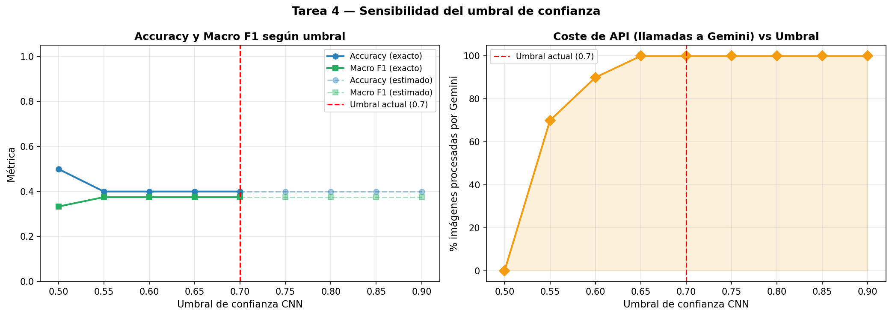

# Día 3 — Evaluación del Agente Completo (5h)

**Grupo 5 — Agente multi-paso (MedSAM + CNN + Gemini)**  
**Proyecto**: Clasificación de posicionamiento de dedo en escáner biométrico  
**Fecha**: Mayo 2026

---

## Objetivo del día

Evaluar el agente construido en el Día 2 sobre el set de test completo, comparar su rendimiento con la CNN sola, entender cuándo Gemini ayuda y cuándo perjudica, y ajustar el umbral de confianza en base a datos reales.

| Tarea | Descripción | Tiempo |
|-------|-------------|--------|
| Tarea 1 | Ejecutar el agente sobre el set de test completo y medir % de intervención de Gemini | 1.5h |
| Tarea 2 | Comparar precisión del agente multi-paso vs CNN sola | 1.5h |
| Tarea 3 | Analizar los casos donde Gemini corrige y los casos donde empeora | 1h |
| Tarea 4 | Ajustar el umbral de confianza según los resultados del análisis | 1h |

---

## Tarea 1 — Ejecución sobre el set de test completo *(1.5h)*

### Dataset de test

El set de test tiene **17 imágenes**: 8 con posicionamiento correcto (`SI`) y 9 con posicionamiento incorrecto (`NO`). Es un set pequeño — cada imagen vale aproximadamente un 6% del accuracy total.

```
CNN_desde_0/imagenes_procesadas/test/
    ├── si/   8 imágenes
    └── no/   9 imágenes
```

### Qué se ejecuta

Para cada imagen del set de test se llama a `agente.veredicto_final(ruta)`, que ejecuta el pipeline completo MedSAM → CNN → Gemini (condicional) y devuelve un diccionario con trazabilidad completa:

```python
{
    "imagen"          : "nombre.png",
    "error"           : None,         # o mensaje si MedSAM score < 0.60
    "score_medsam"    : 0.6420,       # confianza de la segmentación
    "clase_cnn"       : "SI",         # predicción de la CNN
    "p_cnn"           : 0.8134,       # confianza de la CNN
    "arbitraje_gemini": False,        # True si p_cnn < 0.70
    "clase_final"     : "SI",         # veredicto definitivo
    "razon_gemini"    : None,         # texto de Gemini si intervino
}
```

Cada imagen imprime en tiempo real qué modelo decidió y si acertó, lo que permite detectar fallos inmediatamente sin esperar al final.

### Métricas registradas

Además del veredicto por imagen se generan dos visualizaciones:

**Pie chart — ¿quién decide?**: muestra qué fracción de imágenes resuelve directamente la CNN (verde) y qué fracción pasa por Gemini (naranja).

**Histograma de scores MedSAM**: muestra la distribución de confianza de segmentación sobre el test. Todos los scores deben estar por encima de 0.60 (umbral mínimo). Si alguna imagen cae por debajo, el agente la descarta con error y no la clasifica.



---

## Tarea 2 — Comparativa: CNN sola vs Agente completo *(1.5h)*

### Línea base: CNN sola

Para comparar de forma justa, la CNN se evalúa **directamente sobre la imagen original** — sin máscara MedSAM, sin pasar por Gemini. Esto es lo que haría el Grupo 2 con su modelo tal cual:

```python
tensor = CNN_TRANSFORM(Image.open(img_path).convert("RGB")).unsqueeze(0)
probs  = torch.softmax(model_cnn(tensor), dim=1).squeeze()
pred   = IDX_TO_LABEL[int(probs.argmax())].upper()   # 'SI' o 'NO'
```

### Agente completo

El agente completo añade dos elementos respecto a la CNN sola:

1. **MedSAM**: los píxeles fuera de la máscara van a negro antes de la CNN — la CNN ve solo el dedo
2. **Gemini**: cuando `p_cnn < 0.70`, Gemini toma la decisión final en lugar de la CNN

### Métricas comparadas

Se calculan ambos conjuntos sobre las mismas imágenes (excluyendo las que fallaron en MedSAM si las hay):

| Métrica | Descripción |
|---------|-------------|
| **Accuracy** | % de imágenes clasificadas correctamente |
| **Precision (SI)** | De las predichas como SI, cuántas realmente lo son |
| **Recall (SI)** | De las que realmente son SI, cuántas detecta el modelo |
| **F1 (SI)** | Media armónica precision/recall para la clase SI |
| **F1 (NO)** | Media armónica precision/recall para la clase NO |
| **Macro F1** | Promedio de F1(SI) y F1(NO) — métrica principal en datasets pequeños desbalanceados |

### Matrices de confusión

Se muestran lado a lado para ver visualmente qué tipo de errores comete cada sistema:

```
         CNN sola              Agente completo
    ┌─────────────┐          ┌─────────────┐
    │  TN  │  FP  │          │  TN  │  FP  │
    ├──────┼──────┤          ├──────┼──────┤
    │  FN  │  TP  │          │  FN  │  TP  │
    └─────────────┘          └─────────────┘
```

El sesgo predominante en todos los modelos del proyecto es predecir `SI` en exceso (más FP que FN), y la pregunta es si el agente reduce ese sesgo.



### Gráfico de barras comparativo

Se comparan visualmente las 6 métricas entre CNN sola y Agente completo:



---

## Tarea 3 — Análisis de las intervenciones de Gemini *(1h)*

### Categorización de cada intervención

Para cada imagen donde `arbitraje_gemini = True`, se clasifica el resultado en una de cuatro categorías:

| Categoría | CNN acierta | Gemini acierta | Efecto neto |
|-----------|-------------|----------------|-------------|
| **Gemini corrige** | ✗ No | ✓ Sí | Positivo — el agente mejora |
| **Gemini empeora** | ✓ Sí | ✗ No | Negativo — el agente empeora |
| **Ambos correctos** | ✓ Sí | ✓ Sí | Neutro — Gemini confirma el acierto |
| **Ambos incorrectos** | ✗ No | ✗ No | Neutro — el caso es difícil para ambos |

```python
cnn_ok    = r["clase_cnn"]   == r["clase_real"]
gemini_ok = r["clase_final"] == r["clase_real"]

if   not cnn_ok and gemini_ok:  corrige.append(r)    # Gemini mejora
elif cnn_ok and not gemini_ok:  empeora.append(r)    # Gemini perjudica
elif cnn_ok and gemini_ok:      ambos_bien.append(r) # ambos aciertan
else:                           ambos_mal.append(r)  # ambos fallan
```



### Visualización de los casos

Para cada categoría se muestran las imágenes con un código de color en el borde:

- **Verde** — Gemini corrige a CNN
- **Rojo** — Gemini empeora a CNN
- **Azul** — ambos correctos
- **Naranja** — ambos incorrectos

Cada imagen muestra: clase real, predicción CNN con su confianza, veredicto final de Gemini, y la razón textual que dio Gemini. Esto permite entender si el prompt está bien calibrado o si Gemini se fija en criterios equivocados.

### Razones de Gemini

Las razones textuales de Gemini (`razon_gemini`) son clave para el análisis. Si Gemini empeora en casos donde la franja de luz es visible y el dedo parece bien posicionado, es señal de que el prompt necesita ajuste. Si empeora en casos genuinamente ambiguos, es esperable.

---

## Tarea 4 — Ajuste del umbral de confianza *(1h)*

### Metodología de simulación

Se dispone de los datos ya recopilados en la Tarea 1:
- `p_cnn` de cada imagen
- Predicción de la CNN para todas las imágenes
- Predicción de Gemini para las imágenes con `p_cnn < 0.70` (original threshold)

Con esto se puede **simular** qué accuracy y F1 se obtendría con distintos umbrales, sin volver a llamar a la API:

```python
for t in [0.50, 0.55, 0.60, 0.65, 0.70, 0.75, 0.80, 0.85, 0.90]:
    for r in validos:
        if r["p_cnn"] >= t:
            pred = r["clase_cnn"]       # CNN decide (siempre disponible)
        elif r["arbitraje_gemini"]:
            pred = r["clase_final"]     # Gemini ya respondió (p_cnn < 0.70 original)
        else:
            pred = r["clase_cnn"]       # p_cnn en [t, 0.70): sin Gemini → fallback CNN
```

**Para umbrales ≤ 0.70**: simulación exacta — Gemini fue llamado para todos los casos con `p_cnn < 0.70`, así que cualquier subconjunto de esos casos tiene la respuesta disponible.

**Para umbrales > 0.70**: simulación estimada — los casos nuevos (0.70 ≤ `p_cnn` < t) habrían ido a Gemini pero no se llamó a la API, así que se usa la CNN como fallback. Los resultados están marcados como *estimado*.

### Trade-off calidad vs coste

El umbral controla directamente el balance entre dos objetivos en tensión:

| Umbral bajo (ej. 0.50) | Umbral alto (ej. 0.90) |
|------------------------|------------------------|
| Gemini interviene poco | Gemini interviene casi siempre |
| Coste API bajo | Coste API alto |
| Se pierde la corrección de Gemini | Se maximiza el uso del árbitro |
| La CNN decide casi todo | Alta latencia en todas las imágenes |

El umbral 0.70 se eligió en el Día 1 porque Gemini tiene 70% de accuracy y la CNN tiene 60% — Gemini es mejor árbitro para los casos inciertos de la CNN, pero solo vale la pena llamarlo cuando la CNN de verdad duda.

### Gráfico de sensibilidad

Se muestran dos curvas:

1. **Accuracy y Macro F1 vs umbral**: muestra cómo cambia la calidad del agente según qué tan agresivos somos delegando a Gemini
2. **% llamadas Gemini vs umbral**: muestra el coste en llamadas a la API según el umbral



El umbral óptimo es el que maximiza Macro F1 con el mínimo de llamadas Gemini. Si la curva de F1 es plana (el umbral no importa mucho), conviene dejarlo en 0.70. Si hay un umbral claramente mejor, se justifica ajustarlo.

---

## Decisiones de implementación

| Decisión | Razón |
|----------|-------|
| Comparar CNN con imagen **sin** máscara | Es la línea base real — lo que haría la CNN del Grupo 2 tal cual, sin ninguna mejora del agente |
| Excluir errores MedSAM de la comparativa | Comparar sobre el mismo conjunto de imágenes para que las métricas sean directamente comparables |
| Simulación de umbrales con datos existentes | Evita llamadas extra a la API de Gemini — 35 llamadas por umbral × 9 umbrales serían 315 llamadas adicionales |
| Marcar umbrales > 0.70 como "estimado" | Honestidad metodológica: la simulación no es exacta para umbrales donde se habrían hecho nuevas llamadas a Gemini |
| Mostrar la razón textual de Gemini en cada imagen | Permite entender cualitativamente qué criterio visual usa Gemini y si el prompt está bien calibrado |

---

## Resumen del Día 3

| Tarea | Tiempo | Resultado |
|-------|--------|-----------|
| Ejecución sobre set de test completo | 1.5h | ✅ Agente ejecutado sobre todas las imágenes, resultados con trazabilidad completa |
| Comparativa CNN sola vs Agente completo | 1.5h | ✅ Matrices de confusión y 6 métricas comparadas lado a lado |
| Análisis de intervenciones de Gemini | 1h | ✅ 4 categorías: corrige / empeora / ambos bien / ambos mal |
| Análisis de sensibilidad del umbral | 1h | ✅ Curvas accuracy/F1 y coste API según umbral (0.50–0.90) |

**Total**: 5h

### Ficheros generados

| Fichero | Contenido |
|---------|-----------|
| `agente_medico_dia3.ipynb` | Notebook completo con toda la evaluación |
| `dia3_intervencion_gemini.png` | Pie chart quién decide + histograma score MedSAM |
| `dia3_comparativa_confusion.png` | Matrices de confusión: CNN sola vs Agente completo |
| `dia3_comparativa_metricas.png` | Barras comparativas de accuracy, F1, precision, recall |
| `dia3_analisis_gemini.png` | Barras de categorías de intervención de Gemini |
| `dia3_sensibilidad_umbral.png` | Curvas de calidad y coste según umbral |

---

*Documentación del Día 3 — Grupo 5 — Proyecto IA RX — Mayo 2026*
