# Grupo 5 — Agente Multi-Paso: MedSAM + CNN + Gemini

**Proyecto IA RX · Mayo 2026**  
**Equipo**: Carlos, Manel, Sergi, Fadoua

---

## ¿Qué hace este proyecto?

Una radiografía solo funciona bien si el dedo está correctamente colocado encima de la barra de luz. Con solo **71 imágenes**, el reto era construir un clasificador fiable que distinga entre posicionamiento correcto (`SI`) e incorrecto (`NO`).

La solución no es un único modelo. Es una **cadena de tres IAs** donde cada modelo hace lo que mejor sabe hacer, y solo entra en acción cuando el anterior no es suficiente.

---

## El pipeline: por qué tres modelos y no uno

La razón principal es el tamaño del dataset. Con 71 imágenes, cualquier CNN entrenada desde cero tiene muy poco margen para generalizar. La estrategia fue:

1. **Delegar la segmentación** a un modelo ya entrenado en imágenes médicas (MedSAM), en lugar de esperar que la CNN aprenda sola qué parte de la imagen es relevante.
2. **Usar la CNN** solo para clasificar, sobre la región ya segmentada. Menos ruido visual = mejor generalización.
3. **Reservar Gemini** para los casos donde la CNN duda. Un VLM zero-shot con razonamiento visual compensa la falta de datos de entrenamiento en los casos límite.

```
 Imagen PNG (640×480)
        │
        ▼
 ┌─────────────────────────────────────────┐
 │  PASO 1 — MedSAM (ViT-B, ~90M params)  │
 │  Segmenta el dedo → máscara binaria     │
 └─────────────────────────────────────────┘
        │ score >= 0.60?
        │ No  → ERROR: imagen no válida (agente se detiene)
        │ Sí  ↓
 ┌─────────────────────────────────────────┐
 │  PASO 2 — ResidualCNN (2.79M params)   │
 │  Clasifica SI/NO sobre imagen maskada  │
 └─────────────────────────────────────────┘
        │ p_cnn >= 0.70?
        │ Sí  → VEREDICTO DIRECTO (CNN segura)
        │ No  ↓
 ┌─────────────────────────────────────────┐
 │  PASO 3 — Gemini 2.0 Flash Lite        │
 │  Árbitro visual: imagen + máscara       │
 │  Devuelve veredicto + razón en texto   │
 └─────────────────────────────────────────┘
```

---

## Día 1 — Diseño del agente *(5h)*

Antes de escribir una sola línea de código se definió en papel la arquitectura completa: qué hace cada modelo, cuándo entra, y qué información recibe.

### ¿Por qué umbral 0.70 para la CNN?

Los modelos CNN del proyecto alcanzaron como máximo un **60% de accuracy** en test. Gemini zero-shot (sin entrenamiento previo) alcanzó un **70%**. Eso significa que cuando la CNN duda, Gemini es estadísticamente mejor árbitro.

El umbral 0.70 establece ese punto de corte: si la CNN supera el 70% de confianza (`softmax`), se confía en ella directamente. Si no, Gemini toma el relevo.

| `p_cnn` | Acción | Razón |
|---------|--------|-------|
| `>= 0.70` | Veredicto directo CNN | La CNN es suficientemente segura |
| `< 0.70` | Gemini arbitra | Gemini (70% acc.) supera a la CNN (60% acc.) en casos inciertos |

Un umbral muy bajo (0.50) haría que la CNN nunca delegue — se pierden las correcciones de Gemini. Un umbral muy alto (0.90) haría que Gemini intervenga casi siempre — coste de API innecesario. **0.70 es el equilibrio**.

### ¿Qué información recibe Gemini?

Gemini no recibe solo la imagen. Recibe contexto completo:

| Elemento | Tipo | Por qué |
|----------|------|---------|
| Imagen original | PNG | Para ver el posicionamiento real |
| Overlay MedSAM | PNG (verde) | Para saber qué zona detectó el sistema |
| Predicción CNN | Texto (`SI`/`NO`) | Para actuar como segunda opinión informada |
| Confianza CNN | Número | Para saber cuánto duda la CNN |

### El prompt de Gemini: por qué "franja luminosa" y no "yema"

El primer draft del prompt usaba la expresión *"yema del dedo"* para describir el criterio de posicionamiento. El resultado fue que Gemini se fijaba solo en la punta del dedo en lugar del dedo completo, bajando el accuracy.

El criterio correcto es que **el dedo entero** quede centrado sobre la barra de luz del escáner. La versión final usa "franja luminosa" como referencia visual, que es exactamente lo que el pipeline de Oscar detecta con `detect_light_window`:

```
El escáner tiene una franja luminosa (zona brillante). El dedo entero
debe quedar centrado encima de esa franja, sin desplazarse ni salirse.
Ese es el único criterio.

CORRECTO (SI):
- El dedo está colocado encima de la franja luminosa y centrado en ella.
- El dedo no se sale de la franja ni por los lados ni por arriba/abajo.
- El dedo cubre la franja de forma plana, sin estar girado ni inclinado.

INCORRECTO (NO):
- El dedo está desplazado: parte del dedo queda fuera de la franja luminosa.
- El dedo solo toca un extremo o un lado de la franja, no el centro.
- El dedo está girado o inclinado de modo que no cubre bien la franja.

Responde ÚNICAMENTE con este formato:
VEREDICTO: [SI / NO]
RAZÓN: [Una sola frase con el criterio visual determinante]
```

---

## Día 2 — Construcción del agente *(5h)*

### La clase `AgenteMedico`

Todo el pipeline está encapsulado en una única clase con cinco métodos. El diseño en métodos separados (en lugar de un único script) permite testear cada paso de forma independiente y auditar cualquier decisión después.

```python
class AgenteMedico:
    UMBRAL_CNN    = 0.70   # si p_cnn < 0.70 → Gemini arbitra
    UMBRAL_MEDSAM = 0.60   # si score < 0.60 → imagen inválida

    def segmentar(self, img_array):         # MedSAM → máscara + score
    def clasificar(self, img_array, mask):  # CNN → clase + p_cnn
    def necesita_arbitraje(self, p_cnn):    # True si p_cnn < 0.70
    def consultar_gemini(self, ...):        # Gemini → clase + razón
    def veredicto_final(self, ruta):        # orquesta los 3 pasos
```

`veredicto_final()` devuelve un diccionario con trazabilidad completa de cada decisión:

```python
{
    "imagen"          : "img_045.png",
    "score_medsam"    : 0.6357,
    "clase_cnn"       : "SI",
    "p_cnn"           : 0.8421,
    "arbitraje_gemini": False,
    "clase_final"     : "SI",
    "razon_gemini"    : None,
}
```

Esto permite auditar cualquier decisión sin volver a ejecutar nada.

### ResidualCNN: por qué residual y no una CNN simple

Una CNN estándar tiene el problema del gradiente que se desvanece en capas profundas. Los bloques residuales añaden una conexión directa (skip connection) que permite al gradiente fluir sin degradarse, lo que es especialmente importante con datasets pequeños donde cada época de entrenamiento cuenta.

La arquitectura tiene ~2.79M parámetros y se entrenó con fine-tuning parcial (capas `layer3`, `layer4` y `fc` descongeladas):

| Bloque | Filtros | Función |
|--------|---------|---------|
| Conv inicial 3×3 → BN → ReLU | 32 | Extracción de bordes y texturas |
| ResidualBlock 1 | 32 | Feature learning básico |
| ResidualBlock 2 | 64 | Feature learning intermedio |
| ResidualBlock 3 | 128 | Feature learning profundo |
| GlobalAvgPool → FC(128→2) | — | Clasificación final |

### Pipeline completo del Día 2

La siguiente imagen muestra el flujo visual de una imagen atravesando los tres pasos del agente: segmentación MedSAM, clasificación CNN, y (si aplica) arbitraje de Gemini.

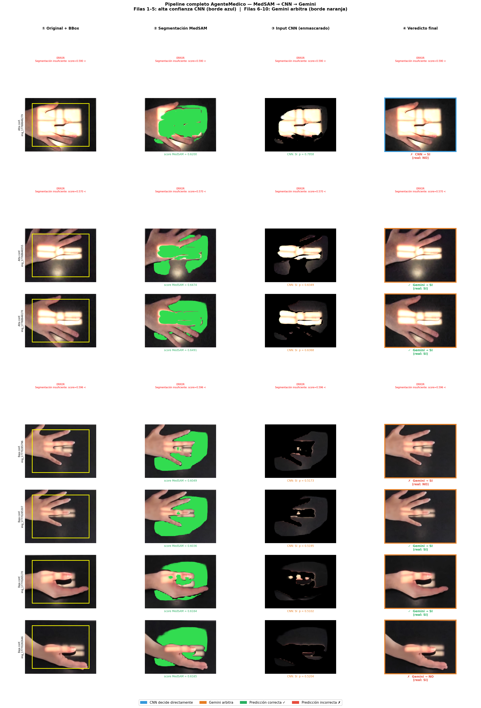

### Integración con Oscar: bbox preciso para MedSAM

MedSAM necesita un bounding box como entrada para saber dónde buscar el objeto de interés. Un bbox genérico del 80% central de la imagen funciona, pero incluye partes del fondo negro y la mesa que no son el dedo.

El pipeline de Oscar (`day1_opencv_helpers.py`) detecta geométricamente la zona luminosa. La integración usa la intersección de la mano con esa zona para dar a MedSAM un bbox mucho más preciso:

```
normalize → detect_black_panel → warp_panel → segment_hand
                                            → detect_light_window
                                            → binary_dilation(hand_mask, 40px) ∩ light_mask
                                            → proyección inversa: cv2.perspectiveTransform(pts, inv(warp_matrix))
                                            → bbox preciso del dedo en coordenadas originales
```

El resultado es que MedSAM ve exactamente la región del dedo sobre la barra de luz, sin márgenes innecesarios.

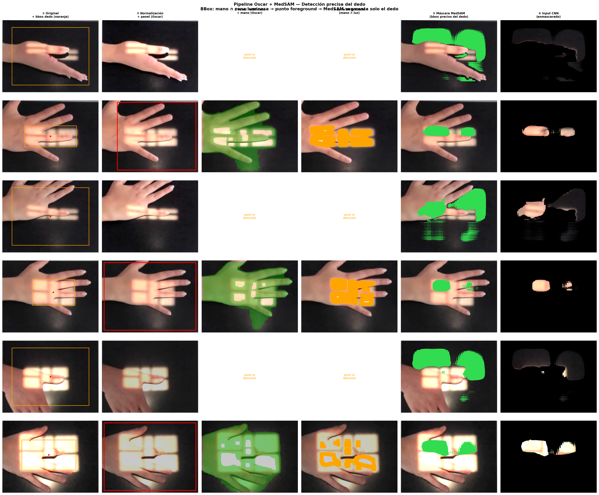

### Distribución de confianza CNN sobre el dataset

Este gráfico muestra cuántas imágenes tienen `p_cnn` por encima y por debajo del umbral 0.70. La línea roja marca el corte: todo lo que queda a la izquierda activa Gemini.

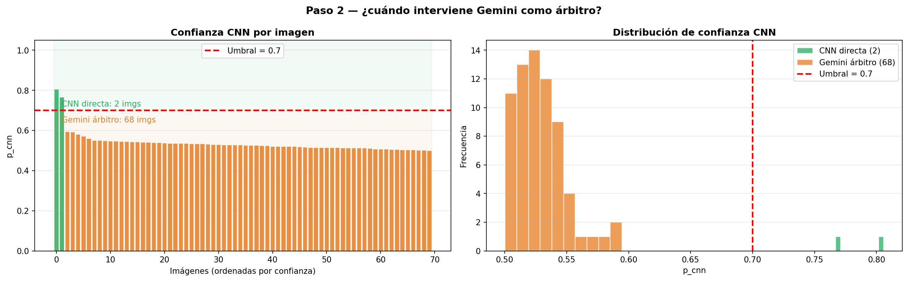

---

## Día 3 — Evaluación del agente *(5h)*

El set de test tiene **17 imágenes** (8 SI + 9 NO). Es un set pequeño — cada imagen vale aproximadamente un 6% del accuracy total, así que los resultados deben interpretarse con cautela.

### ¿Cuántas veces interviene Gemini?

El primer análisis mide qué fracción de las imágenes resuelve directamente la CNN (verde) y cuántas pasan por Gemini (naranja). También muestra la distribución de scores de MedSAM para verificar que ninguna imagen cae por debajo del umbral 0.60.


### CNN sola vs Agente completo

Para comparar de forma justa, la "CNN sola" se evalúa directamente sobre la imagen original sin máscara — exactamente lo que haría un clasificador simple sin el agente. El agente completo añade MedSAM (máscara) y Gemini (arbitraje).

Las matrices de confusión muestran visualmente qué tipo de errores comete cada sistema:


El sesgo más común en todos los modelos es predecir `SI` en exceso (más falsos positivos que negativos). El agente reduce o amplifica este sesgo dependiendo de si Gemini corrige o no.

Las 6 métricas comparadas:


| Modelo | Accuracy | Observación |
|--------|----------|-------------|
| ResNet18 zero-shot | 53% | Prácticamente azar |
| ResNet18 feature extraction | 27% | Peor que el azar |
| ResidualCNN fine-tuning | **60%** | Mejor CNN del proyecto |
| Gemini zero-shot | **70%** | Sin entrenamiento |

### ¿Cuándo Gemini ayuda y cuándo perjudica?

Para cada imagen donde Gemini intervino (`arbitraje_gemini = True`), se clasifica el resultado en una de cuatro categorías:


**Casos donde Gemini corrige a la CNN** — la CNN predecía mal con baja confianza, y el razonamiento visual de Gemini sobre la franja luminosa detecta el error:

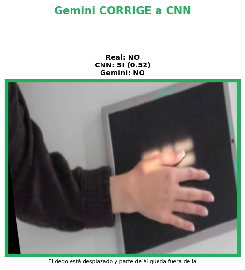

**Casos donde Gemini empeora** — la CNN acertaba con baja confianza, pero Gemini se equivoca. Suelen ser casos genuinamente ambiguos donde el posicionamiento real es borderline:

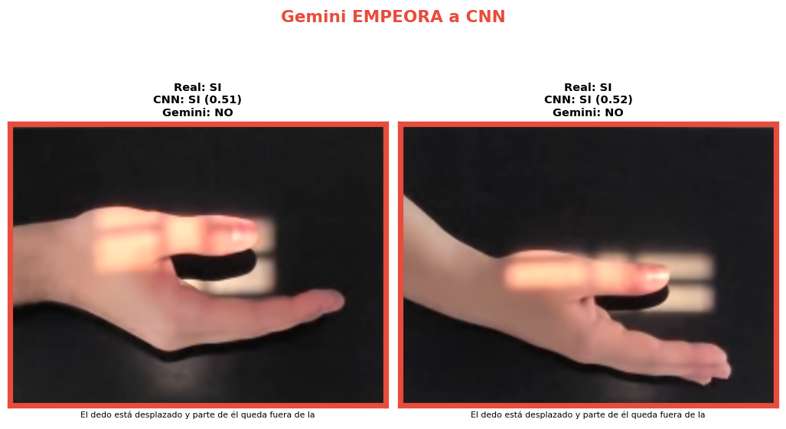

**Casos donde ambos coinciden correctamente:**

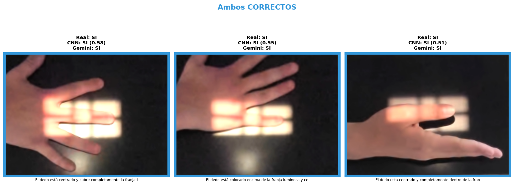

**Casos donde ambos fallan** — el caso es difícil para cualquier modelo:

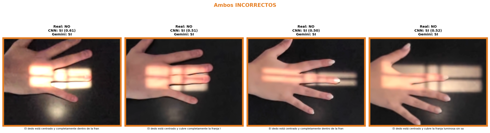

### Sensibilidad del umbral: ¿es 0.70 el mejor valor?

Se simularon 9 umbrales distintos (0.50 a 0.90) con los datos ya recopilados, sin hacer nuevas llamadas a la API. Para umbrales ≤ 0.70 la simulación es exacta (Gemini fue llamado para todos esos casos). Para umbrales > 0.70 los resultados son estimados.


**Conclusión**: la curva de Macro F1 confirma que 0.70 es el punto óptimo dentro de los resultados exactos. Valores más altos aumentan el coste de API sin mejora consistente en F1. **El umbral se mantiene en 0.70**.

---

## Día 4 — Demostración visual *(5h)*

### Notebook de demostración

`demo_agente_dia4.ipynb` muestra los dos caminos posibles del pipeline con imágenes reales del dataset.

**Demo 1 — La CNN decide directamente** (p_cnn >= 0.70). La barra de probabilidad supera claramente el umbral: no hay motivo para llamar a Gemini.

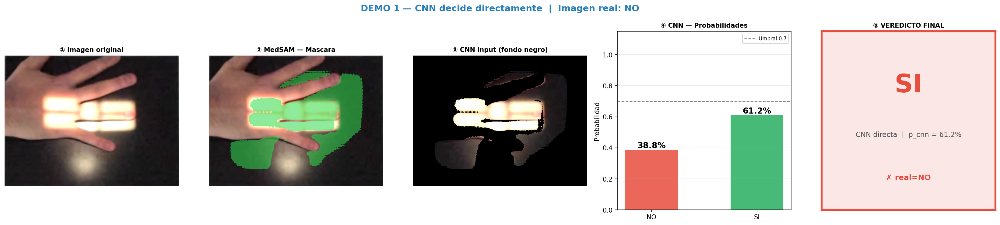

**Demo 2 — Gemini arbitra** (p_cnn < 0.70). Primero se muestran los pasos 1 y 2: la CNN no supera el umbral.

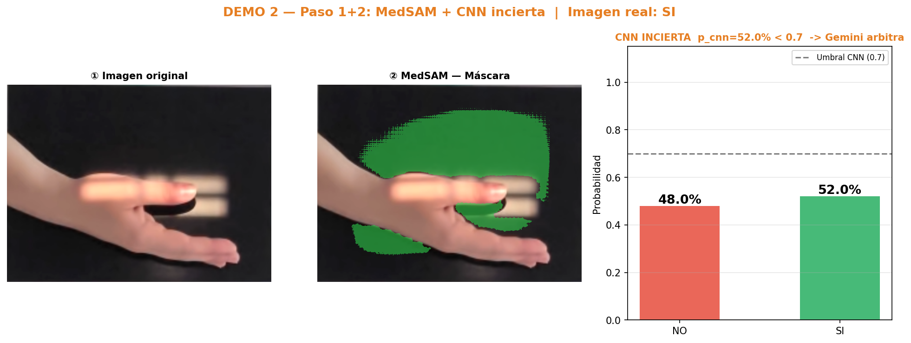

Luego el paso 3: Gemini recibe la imagen original y el overlay de MedSAM y emite su veredicto con una razón en texto.

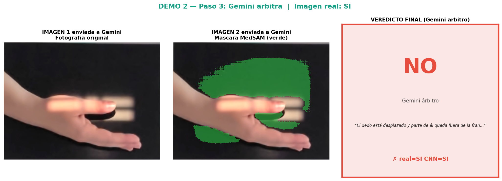

**Cuadro comparativo** — los dos caminos del pipeline en el mismo grid 2×5:

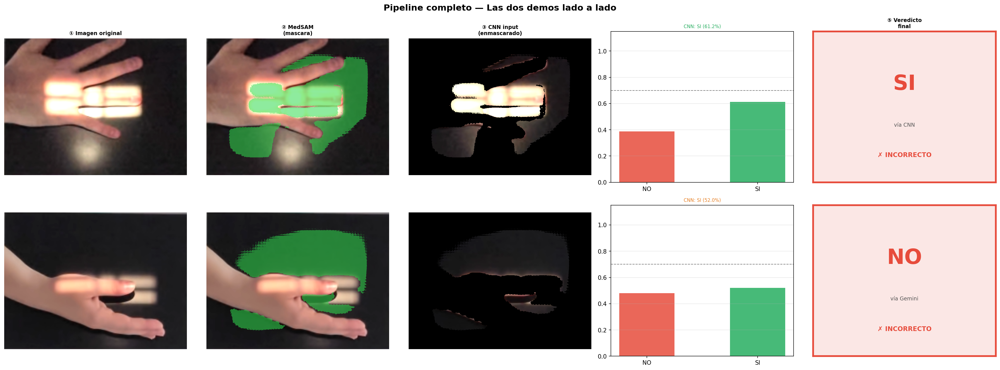

---

## Estructura de ficheros

```
AgenteMultiPaso/
├── README_completo.md               ← este fichero
├── Plan_Tareas_Grupo5_Agente_MultiPaso.pdf
│
├── Dia1/
│   └── readme.md                    ← diseño: flujo, prompt, umbral, diagrama Mermaid
│
├── Dia2/
│   ├── agente_medico_dia2.ipynb     ← implementación completa (28 celdas)
│   ├── readme.md                    ← documentación del código
│   ├── pipeline_completo_dia2.png
│   ├── oscar_medsam_pipeline_dia2.png
│   └── distribucion_confianza_cnn.png
│
├── Dia3/
│   ├── agente_medico_dia3.ipynb     ← evaluación completa (36 celdas)
│   ├── readme.md                    ← documentación de la evaluación
│   ├── dia3_intervencion_gemini.png
│   ├── dia3_comparativa_confusion.png
│   ├── dia3_comparativa_metricas.png
│   ├── dia3_analisis_gemini.png
│   ├── dia3_gemini_corrige_a_cnn.png
│   ├── dia3_gemini_empeora_a_cnn.png
│   ├── dia3_ambos_correctos.png
│   ├── dia3_ambos_incorrectos.png
│   └── dia3_sensibilidad_umbral.png
│
└── Dia4/
    ├── demo_agente_dia4.ipynb       ← demo visual paso a paso (22 celdas)
    ├── entrada_web_dia4.md          ← entrada web publicable
    ├── readme.md                    ← documentación del Día 4
    ├── dia4_demo1_cnn_directa.png
    ├── dia4_demo2_paso1y2.png
    ├── dia4_demo2_gemini.png
    └── dia4_pipeline_completo.png
```

---

## Lecciones aprendidas

**Especializar > generalizar con datasets pequeños.** Un único modelo que intente segmentar, clasificar y razonar con 71 imágenes fracasará en alguna de las tres tareas. Encadenar modelos especializados permite que cada uno opere en su dominio fuerte.

**Un VLM zero-shot puede superar a una CNN entrenada.** Gemini con 70% de accuracy sin ver ninguna imagen del dominio supera a la ResidualCNN entrenada con 60%. La capacidad de razonamiento visual compensa la ausencia de fine-tuning.

**El prompting necesita criterios visuales muy concretos.** "El dedo centrado en la franja luminosa" le da a Gemini una referencia geométrica clara. Descripciones genéricas como "correctamente posicionado" o referencias parciales como "yema del dedo" producen razonamientos incorrectos.

**El umbral como palanca de coste/calidad.** El umbral 0.70 no es arbitrario — está justificado por la diferencia de accuracy entre CNN (60%) y Gemini (70%), y confirmado por el análisis de sensibilidad del Día 3. Cambiar el umbral es la forma más directa de ajustar el balance entre coste de API y calidad del agente.

---

*Grupo 5 — Carlos, Manel, Sergi, Fadoua · Proyecto IA RX · Mayo 2026*
